[](https://github.com/Willian-Brito/viaja-brasil/actions/workflows/CI.yaml)

# 🏦 Evertec - Teste Técnico para Analista de Sistemas
Este repositório foi criado para realizar o teste técnico para o cargo de analista de sistemas da empresa Evertec

## 🇧🇷 Viaja Brasil

Aplicação para cadastro e consulta de pontos turísticos brasileiros.

<div align="center">
    
</div>

### ✨ Funcionalidades
- 🏖️ Cadastro de pontos turísticos
- 🔍 Busca por nome, descrição ou localização
- 📄 Listagem paginada
- 🏙️ Seleção de estado e cidade
- 📍 Visualização detalhada dos pontos turísticos
- 🐳 Execução via Docker
- 🧪 Testes unitários e de integração

### 🏛️ Arquitetura

O back-end foi desenvolvido seguindo princípios de:

- 🧹 Clean Architecture
- 🎯 Domain Driven Design (DDD)
- 🔒 SOLID
- 🧩 Separation of Concerns

#### 📱 App
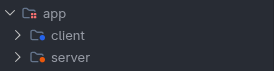

     
#### 📁 Back-end:

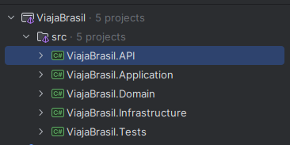

#### 📁 Front-end:

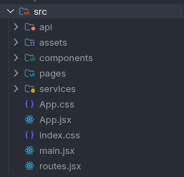

### 🧠 ViajaBrasil.Domain

Contém as regras de negócio da aplicação.

#### Responsabilidades
- 📦 Entidades
- ⚠️ Exceções de domínio
- 📜 Contratos
- 🏷️ Enumerações

### ⚙️ ViajaBrasil.Application
A camada de aplicação deve orquestrar os casos de uso da aplicação, sem conhecer detalhes de infraestrutura.

### Ela:
- recebe requests
- valida entrada
- chama domínio
- persiste dados
- retorna DTOs

#### Responsabilidades
- 📋 DTOs
- 🛠️ Services
- ✅ Validators
- 🔄 Mapeamentos

### 💾 ViajaBrasil.Infrastructure
Implementação de acesso aos dados.

#### Tecnologias:
- 🗄️ Entity Framework Core
- 🪶 SQLite

#### Responsabilidades:
- 📂 Repositórios
- 🗃️ DbContext
- 🧬 Mapeamentos
- 🚀 Migrations
- 🌱 Seed de dados

### 🌐 ViajaBrasil.API
Camada de exposição dos endpoints HTTP.

#### Responsabilidades:
- 🎮 Controllers
- 🔗 Dependency Injection
- ⚙️ Configurações
- 🛡️ Middlewares

---

### 💻 Front-End

#### Tecnologias utilizadas:
- ⚛️ React
- ⚡ Vite
- 🌐 Axios
- 🎨 Bootstrap 5
- 🧭 React Router

#### Funcionalidades:
- 📄 Listagem paginada
- 🔍 Busca textual
- ➕ Cadastro de pontos turísticos
- 📍 Consulta detalhada
- 🚀 Navegação SPA


## 🧪 Testes Automatizados

Este projeto utiliza testes unitários e testes de integração para garantir maior confiabilidade, qualidade e segurança na evolução das APIs.


- **📌 Testes Unitários:** Foram criados testes para validação das principais regras de negócio, commands e handlers.
- **📌 Testes de Integração:** Testes realizados validando o comportamento real da API ponta a ponta.

#### ▶️ Como executar os testes
```bash
dotnet test
```

#### ⬛ Terminal
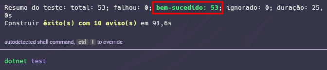

#### 🟫 Rider
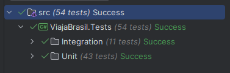

#### 🟦 VS Code
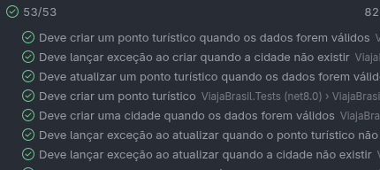

## 🐳 Docker
Aplicação totalmente containerizada para facilitar execução, deploy e padronização de ambiente.

#### Subir container
```bash
# Vá para raiz do projeto (/app)
docker compose up -d
```


## 🔁 Pipeline CI/CD
Pipeline automatizada utilizando GitHub Actions.

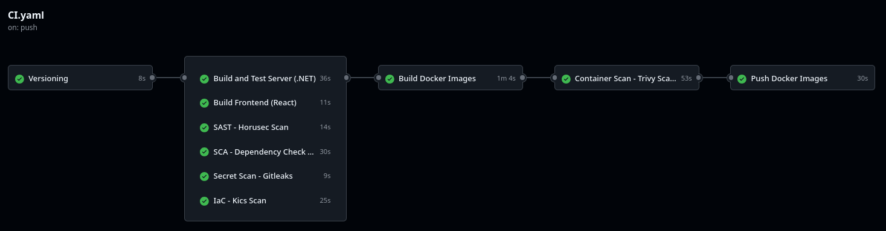

#### A pipeline realiza automaticamente:
```bash
✅ Versionamento
✅ Build
✅ Restore
✅ Testes
✅ Análise SAST
✅ Análise SCA
✅ Secret Scan
✅ IaC Scan
✅ Build Docker
✅ Container Scan
✅ Push Docker Hub
```

### 🔐 DevSecOps
Abaixo está um resumo das etapas executadas em cada build:

1. **Execução do Horusec (SAST):** Identificar vulnerabilidades no código-fonte antes da aplicação ser compilada ou executada.
1. **Execução do Dependency-Check (SCA):** Detectar bibliotecas e dependências vulneráveis.
1. **Execução do GitLeaks (Secret Scan):** Detectar informações sensíveis que foram parar no repositório por engano, como Tokens de API, Senhas, Chaves SSH, etc.
1. **Análise de IaC com KICS:** Analisar arquivos de configuração e infraestrutura (Terraform, Kubernetes, Docker) para encontrar falhas de segurança antes do provisionamento.
1. **Varredura de containers com Trivy:** Analisar imagens Docker em busca de vulnerabilidades em pacotes do sistema operacional e bibliotecas de aplicação.

#### 🛡️ Pipeline de Segurança
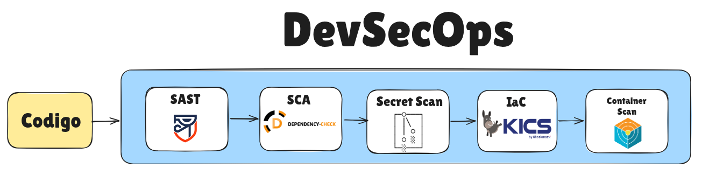

--- 

## 🚀 Como Executar o Projeto

O projeto pode ser executado normalmente por qualquer IDE compatível com .NET 8, como:

- Visual Studio
- JetBrains Rider
- Visual Studio Code


#### </> Ambiente de desenvolvimento
```bash
## clonando projeto
git clone git@github.com:Willian-Brito/viaja-brasil.git

## Entrando na pasta do projeto
cd viaja-brasil

## Executando projetos

## Back-end (Execute na pasta app/server/src/ViajaBrasil.API)
dotnet run

## Front-end (Execute na pasta app/client)
npm install # instalar as dependências
npm run dev
```

#### 🔗 URLs
- **⚙️ Back-end:** http://localhost:5215/swagger/index.html
- **🌐 Front-End:** http://localhost:5173/

Porém, a forma mais simples e rápida de subir toda a aplicação é utilizando Docker + Docker Compose, pois toda a infraestrutura necessária já será criada automaticamente 🚀

#### Esse comando irá:
- criar a imagem Docker do back-end e front-end 
- subir o container automaticamente
- criar o banco SQLite
- aplicar automaticamente as migrations do Entity Framework Core
- popular o banco com os dados iniciais **(seed - cidades e pontos turisticos)**

### 🐳 Ambiente docker
```bash
## clonando projeto
git clone git@github.com:Willian-Brito/viaja-brasil.git

## Entrando na pasta do projeto
cd viaja-brasil

## Executando projetos (front/back)
docker compose up -d

## Derrubar containers
docker compose down -v
```

#### 🔗 URLs
- **⚙️ Back-end:** http://localhost:5215/swagger/index.html
- **🌐 Front-End:** http://localhost:8081

--- 

## 🖥️ Viaja Brasil (Telas)

### 🏠 Home Listagem paginada
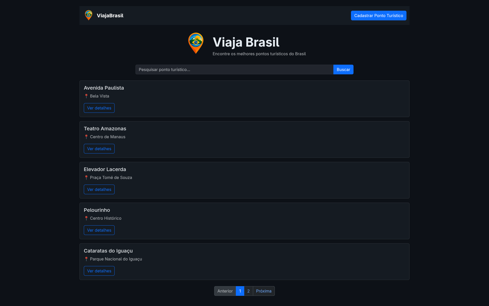

### 🏖️ Cadastro de pontos turísticos
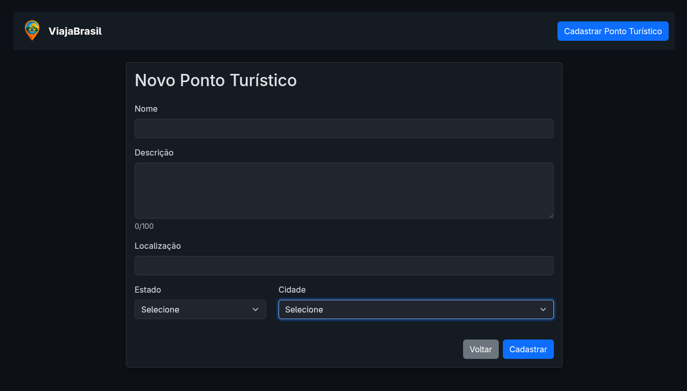

### 🏙️ Seleção de cidade a partir de um estado
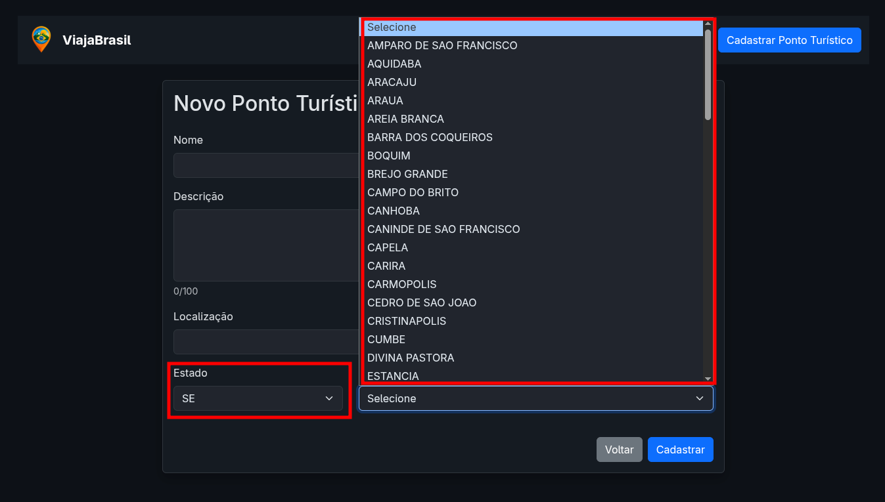

### 🔍 Busca por nome, descrição ou localização
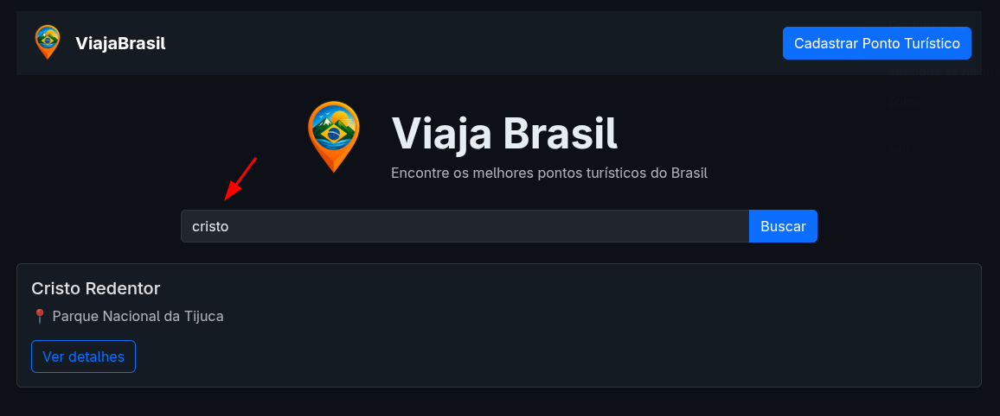

### 📍 Visualização detalhada dos pontos turísticos
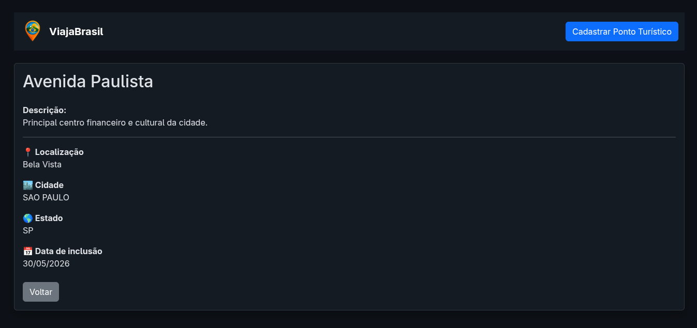

### 📝 Swagger
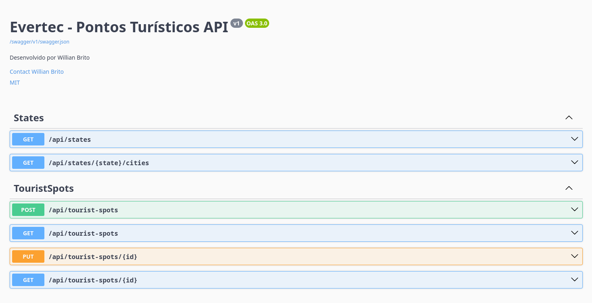

## 🎥 Vídeo de Apresentação

Foi disponibilizado um vídeo demonstrando a solução desenvolvida, incluindo aspectos funcionais e técnicos do projeto.

#### 🔗 Link: https://youtu.be/_L1X_9GDses

> 🔒 O vídeo foi publicado no YouTube na modalidade **Não Listado**, permitindo acesso apenas por meio do link compartilhado.
>
> Essa abordagem foi adotada para preservar a confidencialidade da resolução do teste técnico e evitar sua indexação ou divulgação pública.